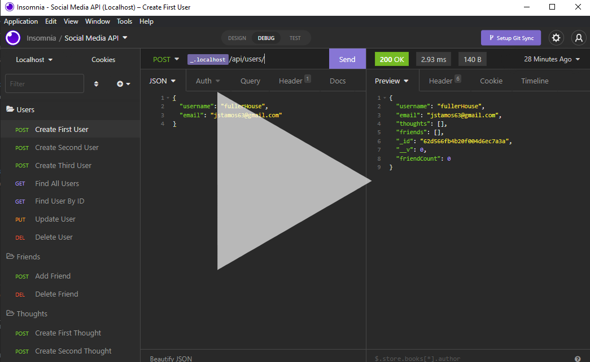

# Social Network API
    
<h2><a href="/docs">Docs</a></h2>

## Table of Contents:  
1. [Description](#Description)  
2. [Demonstration](#Walkthrough-Videos)  
4. [Installation](#Installation)  

## Description
This is a NodeJS REST API that uses a NoSQL database. Through the API:
- Users can be created/updated/deleted
- Users can add/remove friends
- Users can create/update/delete thoughts
- Users can add/remove reactions to users' thoughts

## Demonstration
[]()

## Installation
- Make sure you have [NodeJS](https://nodejs.org/en/download/) installed
- Clone the project to your machine
-  Navigate to the project folder in your terminal, using MySQL shell run
```bash
npm i
npm start
```
- Test API calls using Insomnia or your tool of choice through localhost:3001